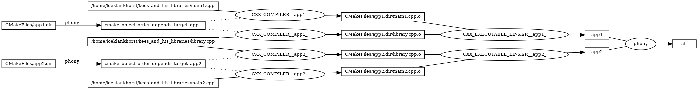
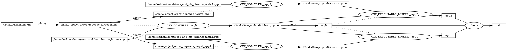

# Library versus no library

This chapter explains how using a library can save resources for bigger projects and keeps the code base maintainable.

# Not using a library

The example below shows how to create two executables where both use the same `library.cpp`.

```CMake
add_executable(app1 main1.cpp library.cpp)
add_executable(app1 main2.cpp library.cpp)
```
This results in the following build graph where library.cpp is compiled into library.cpp.o two times, for both executables.



# Using a library

When a library is created that is shared between both executables, the `library.cpp` file is compiled once.

```CMake
add_library(mylib STATIC library.cpp)
add_executable(app1 main1.cpp)
add_executable(app2 main2.cpp)
target_link_libraries(app1 mylib)
target_link_libraries(app2 mylib)
```

This library is stored as `libmylib.a` which is an archived library. This introduces the overhead of archiving the library.


# Using an OBJECT library

```CMake
add_library(mylib OBJECT library.cpp)
add_executable(app1 main1.cpp)
add_executable(app2 main2.cpp)
target_link_libraries(app1 mylib)
target_link_libraries(app2 mylib)
```

When OBJECT is passed to the add_library function, the archiving step is skipped and the object files are passed to the linker.
This is a great advantage for libraries that are intended to be used within the same project and are not distributed.

